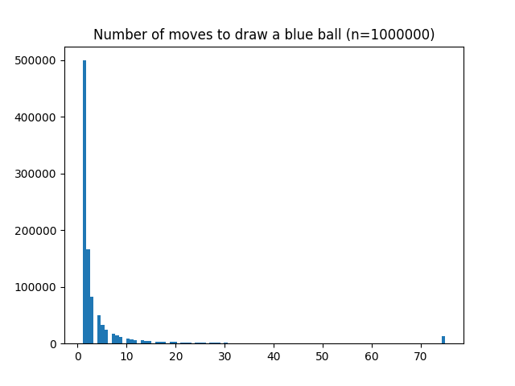

# A Finite Game of Infinite Rounds

This project is a simulation of Joseph Newton's
["A Finite Game of Infinite Rounds"](https://www.youtube.com/watch?v=LUCvSsx6-EU)
video. It draws out a histogram of the number of rounds it takes for a game to
end.

# The Game

Suppose you have a bag with a red and a blue marble in it. The probability of
grabbing either colored marble is 50%. The game plays as follows:

1. Draw a marble.
2. If the marble is red, place the marble back and add another red marble.
3. If the marble is blue, the game ends and you win.
4. Repeat.

## Results

The game was designed such that it automatically ended after 75 rounds,
regardless of the outcome. This was done to prevent the game from running
indefinitely. Interestingly, however, the vast majority of these games ended
extremely quickly.

I re-attempted this with a different game. If the marble is red, three
additional red marbles would be added back. Interestingly, this 'infinite' game
has a larger rate of failure, but still has a large number of games that end
quickly.

# License TL;DR

This project is distributed under the MIT license. This is a paraphrasing of a
[short summary](https://tldrlegal.com/license/mit-license).

This license is a short, permissive software license. Basically, you can do
whatever you want with this software, as long as you include the original
copyright and license notice in any copy of this software/source.

## What you CAN do:

-   You may commercially use this project in any way, and profit off it or the
    code included in any way;
-   You may modify or make changes to this project in any way;
-   You may distribute this project, the compiled code, or its source in any
    way;
-   You may incorporate this work into something that has a more restrictive
    license in any way;
-   And you may use the work for private use.

## What you CANNOT do:

-   You may not hold me (the author) liable for anything that happens to this
    code as well as anything that this code accomplishes. The work is provided
    as-is.

## What you MUST do:

-   You must include the copyright notice in all copies or substantial uses of
    the work;
-   You must include the license notice in all copies or substantial uses of the
    work.

If you're feeling generous, give credit to me somewhere in your projects.
